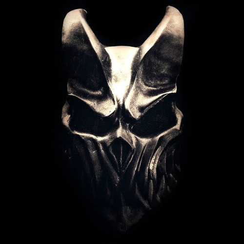
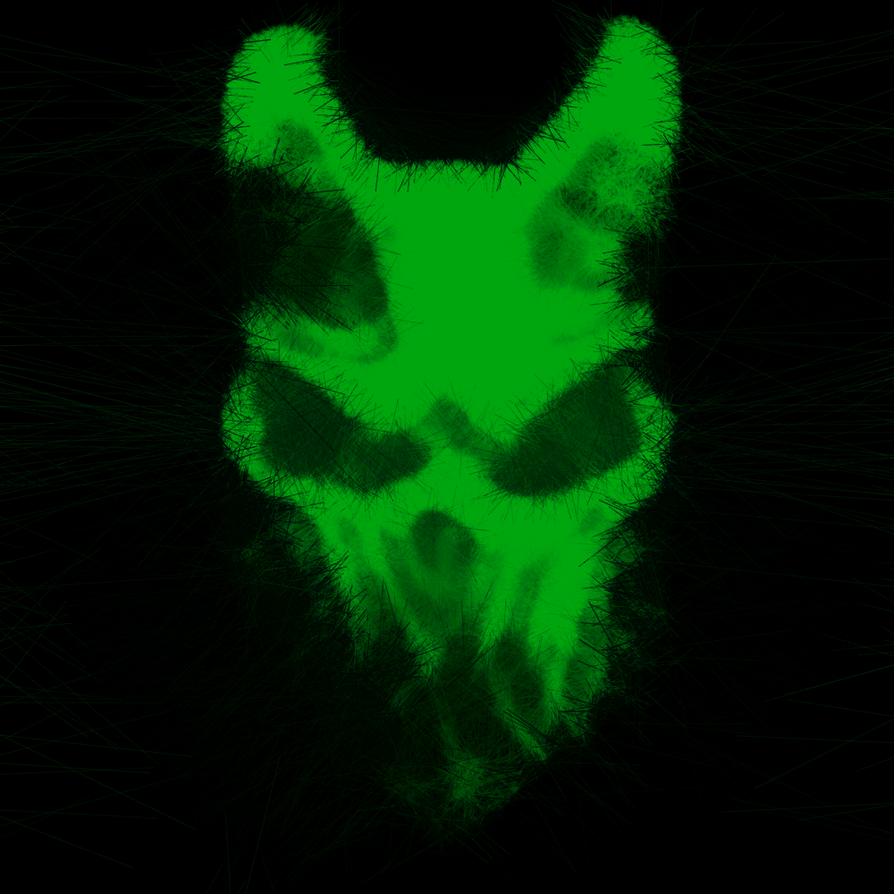
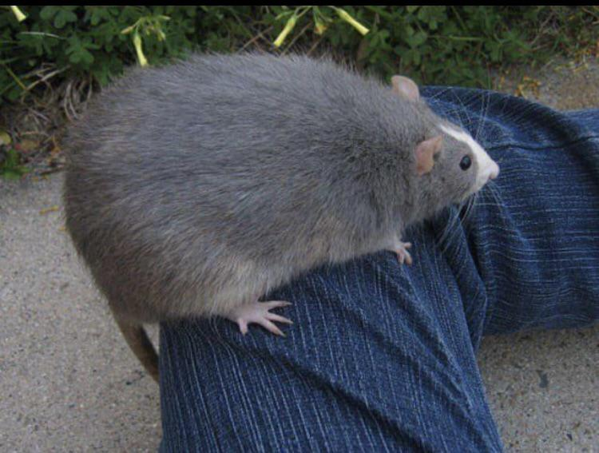
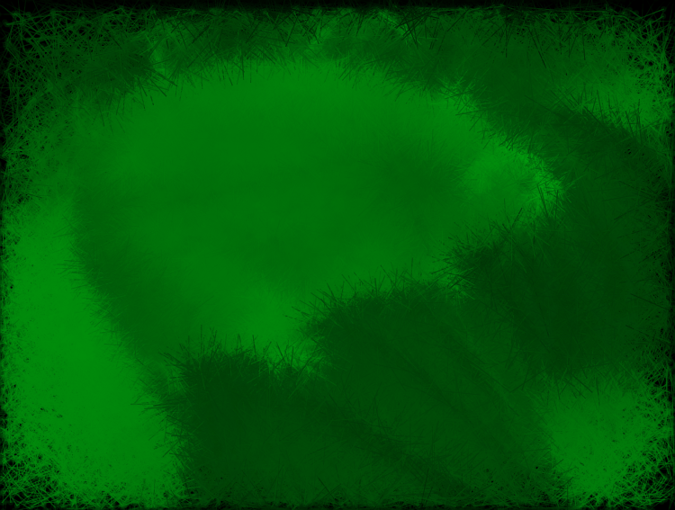

# LineShader

my JS art tool parameter testing UI suite.

`art.js` has the code responsible for the drawing of lines based on an input image.  
It uses HTML canvas and **p5js**.

## Examples
<table>
<tr>
<td>Original</td>
<td>Rendered</td>
</tr>
<tr>
<td>

</td>
<td>

</td>
</tr>
<tr>
<td>

</td>
<td>

</td>
</tr>
</table>
